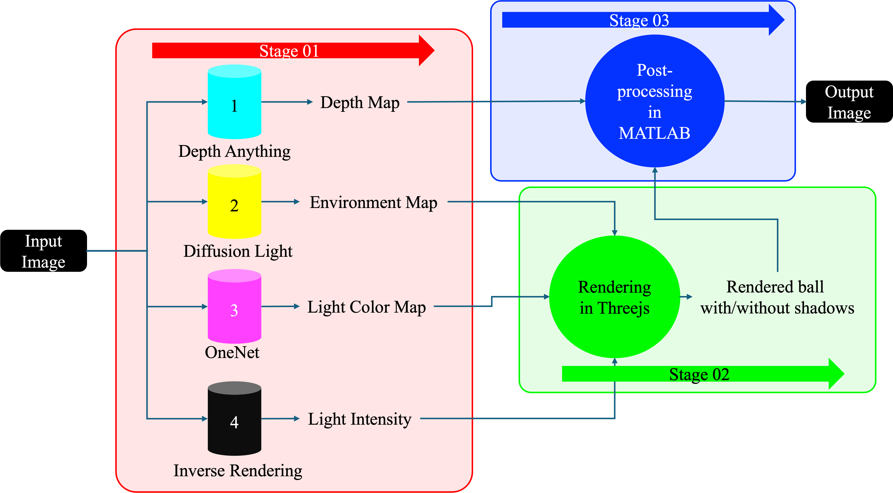

  # Object Insertion in Static RGB Image

🚀 Basic Idea! 🚀

    

## Related Works

This section outlines key research papers relevant to our work, providing quick access to their strengths, limitations, and resources.

### Lite-Mono (CVPR 2023)
- **Description**: A lightweight CNN and Transformer architecture for self-supervised monocular depth estimation.
- **Strengths**: Lightweight architecture, hybrid approach.
- **Limitations**: Trade-off between size and accuracy.
- **Code**: [GitHub](https://github.com/noahzn/Lite-Mono)
- **Paper**: [PDF](https://openaccess.thecvf.com/content/CVPR2023/papers/Zhang_Lite-Mono_A_Lightweight_CNN_and_Transformer_Architecture_for_Self-Supervised_Monocular_CVPR_2023_paper.pdf)
- **Tested**: ✔️

### Depth Anything (CVPR 2024)
- **Description**: Focuses on data coverage, augmentation, and auxiliary supervision to enhance depth prediction.
- **Strengths**: Comprehensive approach to data handling.
- **Limitations**: Relies heavily on data annotations, and complex encoder dependencies.
- **Code**: [GitHub](https://github.com/LiheYoung/Depth-Anything)
- **Paper**: [PDF](https://arxiv.org/pdf/2401.10891.pdf)
- **Tested**: ✔️

### DistDepth (CVPR 2022)
- **Description**: Aims for zero-shot inference, creating structured depth maps and facilitating sim-to-real transitions.
- **Strengths**: Effective in zero-shot inference and sim-to-real applications.
- **Limitations**: Struggles with temporal inconsistency and reflective surfaces.
- **Code**: [GitHub](https://github.com/facebookresearch/DistDepth)
- **Paper**: [PDF](https://openaccess.thecvf.com/content/CVPR2022/papers/Wu_Toward_Practical_Monocular_Indoor_Depth_Estimation_CVPR_2022_paper.pdf)
- **Tested**: ✔️

### UniMatch (TPAMI 2023)
- **Description**: Unifies various learning tasks using a cross-attention mechanism to enhance feature quality and facilitate cross-task transfer.
- **Strengths**: Unified formulation, high-quality feature extraction.
- **Limitations**: Complex integration process, high specificity to tasks.
- **Code**: [GitHub](https://github.com/autonomousvision/unimatch)
- **Paper**: [IEEE](https://ieeexplore.ieee.org/document/10193833)
- **Tested**: ✔️

### $FC^4$ (CVPR 2017)
- **Description**: Utilizes a fully convolutional network focusing on confidence weighting and adaptive pooling for color constancy.
- **Strengths**: Effective in handling ambiguity, and innovative use of convolutional networks.
- **Limitations**: Learning complexity, high dependency on datasets.
- **Code**: [GitHub](https://github.com/yuanming-hu/fc4)
- **Paper**: [PDF](https://openaccess.thecvf.com/content_cvpr_2017/papers/Hu_FC4_Fully_Convolutional_CVPR_2017_paper.pdf)
- **Tested**: ✔️

### Inverse Rendering (CVPR 2020)
- **Description**: Deals with 3D reconstruction, lighting estimation, and reflectance mapping to facilitate inverse rendering of indoor scenes.
- **Strengths**: Comprehensive approach to 3D scene rendering.
- **Limitations**: Complexity in training, dataset reliance, scalability issues.
- **Code**: [GitHub](https://github.com/lzqsd/InverseRenderingOfIndoorScene)
- **Paper**: [CVPR](https://openaccess.thecvf.com/content_CVPR_2020/papers/Li_Inverse_Rendering_for_Complex_Indoor_Scenes_Shape_Spatially-Varying_Lighting_and_CVPR_2020_paper.pdf)
- **Tested**: ✔️

### 3D Copy Paste (NeurIPS 2023)
- **Description**: Enhances scene realism by matching illumination and ensuring physical plausibility through data enrichment techniques.
- **Strengths**: Effective illumination matching, adds realism.
- **Limitations**: Dependent on 3D assets, quality variation.
- **Code**: [GitHub](https://github.com/gyhandy/3D-Copy-Paste)
- **Paper**: [OpenReview](https://openreview.net/pdf?id=d86B6Mdweq)
- **Tested**: ❌

### One-Net (PRL 2022)
- **Description**: Simplifies the network architecture while maintaining robustness and parameter efficiency.
- **Strengths**: Simple yet robust design, efficient in handling parameters.
- **Limitations**: Limited dataset applicability, issues with outlier handling.
- **Code**: [GitHub](https://github.com/sonainjameel/One-Net)
- **Paper**: [ScienceDirect](https://www.sciencedirect.com/science/article/abs/pii/S0167865522001477)
- **Tested**: ✔️

### DiffusionLight (2023)
- **Description**: Utilizes diffusion models for iterative inpainting, addressing challenges in projection models.
- **Strengths**: Innovative use of diffusion models for lighting.
- **Limitations**: Mismatch in projection models, slow processing.
- **Code**: [GitHub](https://github.com/DiffusionLight/DiffusionLight)
- **Paper**: [arXiv](https://arxiv.org/abs/2312.09168)
- **Tested**: ✔️

### ILE (ECCV 2022)
- **Description**: Focuses on comprehensive representation and advanced rendering techniques for indoor lighting editing.
- **Strengths**: Advanced techniques in rendering and light editing.
- **Limitations**: High computational complexity.
- **Code**: [GitHub](https://github.com/ViLab-UCSD/IndoorLightEditing)
- **Paper**: [Springer](https://link.springer.com/chapter/10.1007/978-3-031-20068-7_32)
- **Tested**: ❌

## Remarks
- The current pipeline has been tested for the insertion of the specular sphere and far away from the camera, in the near future, we plan to test this pipeline by varying object material as well as object type.
